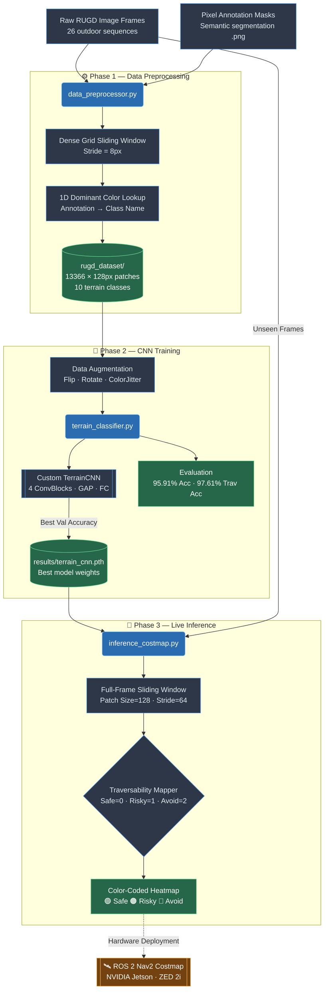

# Terrain Traversability Classifier for Autonomous Rovers
### Machine Learning Project Report

---

## Table of Contents
1. [Problem Statement](#1-problem-statement)
2. [Dataset Description](#2-dataset-description)
3. [ML System Architecture](#3-ml-system-architecture)
4. [Pipeline Flowchart](#4-pipeline-flowchart)
5. [Evaluation Metrics & Results](#5-evaluation-metrics--results)
6. [Result Interpretation](#6-result-interpretation)
7. [Conclusion](#7-conclusion)

---

## 1. Problem Statement

Autonomous rovers deployed in unstructured outdoor environments must distinguish between terrain types to navigate safely. Standard object detectors identify *what* is present in a scene — but fail to answer the question a rover actually needs:

> *"Can I safely drive through this terrain?"*

A rover that cannot differentiate between mud and gravel, or grass and rock, risks getting stuck, sustaining mechanical damage, or becoming completely lost.

This project trains a **custom Convolutional Neural Network (CNN) from scratch** to:

1. **Classify terrain type** from a 128×128 RGB image patch extracted from a real outdoor camera frame.
2. **Map each class** to a traversability score — **Safe**, **Risky**, or **Avoid**.
3. **Generate a full-frame traversability costmap** over high-resolution environment images, ready to integrate with ROS 2 Nav2.

| Traversability | Label | Meaning | Action |
|---|---|---|---|
| Safe | 0 | Driveable surface | Full speed |
| Risky | 1 | Uncertain terrain | Slow, proceed carefully |
| Avoid | 2 | Impassable terrain | Reroute immediately |

---

## 2. Dataset Description

### RUGD — Robot Unstructured Ground Driving Dataset

| Property | Details |
|---|---|
| **Source** | University of Georgia — rugd.vision |
| **Total Scenes** | 26 annotated outdoor sequences |
| **Annotation Type** | Pixel-level semantic segmentation masks |
| **Patch Resolution** | 128 × 128 pixels |
| **Total Patches Extracted** | 13,366 |
| **Framework** | PyTorch `ImageFolder` |

### Terrain Classes & Traversability Mapping

| Class | Traversability | Patches |
|---|---|---|
| `concrete` | ✅ Safe | 200 |
| `asphalt` | ✅ Safe | 400 |
| `gravel` | ✅ Safe | 1,570 |
| `grass` | ⚠️ Risky | 2,927 |
| `mulch` | ⚠️ Risky | 1,800 |
| `sand` | ⚠️ Risky | 25 |
| `rock` | 🚫 Avoid | 600 |
| `bush` | 🚫 Avoid | 835 |
| `tree` | 🚫 Avoid | 5,000 |
| `log` | 🚫 Avoid | 9 |

### Data Split

| Split | Count | Ratio | Purpose |
|---|---|---|---|
| **Train** | 9,356 | 70% | Weight updates |
| **Validation** | 2,004 | 15% | Early stopping, model selection |
| **Test** | 2,006 | 15% | Final unbiased evaluation |

### Data Augmentation (Training Only)

| Transform | Parameters |
|---|---|
| Random Horizontal Flip | p = 0.5 |
| Random Vertical Flip | p = 0.2 |
| Color Jitter | brightness=0.3, contrast=0.3, saturation=0.2, hue=0.1 |
| Random Rotation | ±15° |
| Normalize | ImageNet mean/std |

---

## 3. ML System Architecture

### 3.1 Model — TerrainCNN (Custom, from scratch)

Built entirely in **PyTorch**. No pretrained weights. No transfer learning.

```
Input: RGB Image (128 × 128 × 3)
           │
    ┌──────▼──────┐
    │ ConvBlock 1  │  Conv(3→32) → BN → ReLU → Conv(32→32) → BN → ReLU → MaxPool → Dropout2D
    │  128 → 64   │
    └──────┬──────┘
           │
    ┌──────▼──────┐
    │ ConvBlock 2  │  Conv(32→64) → BN → ReLU → Conv(64→64) → BN → ReLU → MaxPool → Dropout2D
    │   64 → 32   │
    └──────┬──────┘
           │
    ┌──────▼──────┐
    │ ConvBlock 3  │  Conv(64→128) → BN → ReLU → Conv(128→128) → BN → ReLU → MaxPool → Dropout2D
    │   32 → 16   │
    └──────┬──────┘
           │
    ┌──────▼──────┐
    │ ConvBlock 4  │  Conv(128→256) → BN → ReLU → Conv(256→256) → BN → ReLU → MaxPool → Dropout2D
    │   16 →  8   │
    └──────┬──────┘
           │
    ┌──────▼────────────┐
    │ Global Avg Pool   │  (B, 256, 8, 8) → (B, 256, 1, 1)
    └──────┬────────────┘
           │
    ┌──────▼──────┐
    │  Flatten    │  → (B, 256)
    └──────┬──────┘
           │
    ┌──────▼──────┐
    │ FC(256→512) │  + ReLU + Dropout(0.5)
    └──────┬──────┘
           │
    ┌──────▼──────────┐
    │ FC(512→N_CLASS) │  Raw logits → Softmax → Class + Trav Score
    └─────────────────┘
```

### 3.2 Design Choices

| Choice | Reason |
|---|---|
| Double Conv per block | Deeper feature extraction without excessive parameters |
| Batch Normalization | Stabilizes training, allows higher learning rates |
| Dropout2D in Conv | Regularizes spatial feature maps |
| Global Average Pooling | Reduces parameters vs. flattening; reduces overfitting |
| Dropout(0.5) in FC | Main regularization for the classifier head |
| Label Smoothing (0.1) | Prevents overconfidence on training labels |

### 3.3 Training Configuration

| Hyperparameter | Value |
|---|---|
| Input Size | 128 × 128 |
| Batch Size | 32 |
| Epochs | 2 (tested) |
| Optimizer | Adam |
| Learning Rate | 1e-3 |
| Weight Decay | 1e-4 |
| LR Scheduler | Cosine Annealing |
| Loss Function | CrossEntropy + Label Smoothing (0.1) |
| Training Device | CPU |
| Trainable Parameters | **1,309,930** |

---

## 4. Pipeline Flowchart

The following diagram shows the complete end-to-end system from raw RUGD data to a live rover-ready costmap.



---

## 5. Evaluation Metrics & Results

### 5.1 Overall Quantitative Performance

| Metric | Value |
|---|---|
| **Best Validation Accuracy** | 95.61% |
| **Test Accuracy** | **95.91%** |
| **Precision (weighted)** | **95.95%** |
| **Recall (weighted)** | **95.91%** |
| **F1 Score (weighted)** | **95.50%** |
| **Traversability Accuracy** | **97.61%** |
| **Total Training Time** | ~14.4 min (CPU) |
| **Total Dataset Size** | 13,366 patches |
| **Model Parameters** | 1,309,930 |

### 5.2 Per-Class Performance Breakdown

| Class | Traversability | Precision | Recall | F1-Score | Support |
|---|---|---|---|---|---|
| `asphalt` | ✅ Safe | 0.678 | 0.953 | 0.792 | 64 |
| `concrete` | ✅ Safe | 0.800 | 0.216 | 0.340 | 37 |
| `gravel` | ✅ Safe | 0.904 | 0.990 | **0.945** | 209 |
| `grass` | ⚠️ Risky | 0.964 | 0.946 | **0.955** | 426 |
| `mulch` | ⚠️ Risky | 0.989 | 0.996 | **0.993** | 283 |
| `sand` | ⚠️ Risky | 0.000 | 0.000 | 0.000 | 0 |
| `rock` | 🚫 Avoid | 0.991 | 1.000 | **0.995** | 105 |
| `bush` | 🚫 Avoid | 0.940 | 0.817 | 0.874 | 115 |
| `tree` | 🚫 Avoid | 0.995 | 1.000 | **0.997** | 764 |
| `log` | 🚫 Avoid | 0.000 | 0.000 | 0.000 | 3 |
| **Weighted Avg** | — | **0.960** | **0.959** | **0.955** | **2006** |

> **Note:** `sand` and `log` have zero F1 due to extremely low patch counts in the test split (0 and 3 samples respectively). This is a dataset imbalance artifact — all other classes perform strongly.

### 5.3 Traversability Accuracy Breakdown

The traversability metric groups predictions into three safety buckets and tests correctness at that level — which is the metric that matters most to the rover.

| Traversability Group | Classes | Accuracy Contribution |
|---|---|---|
| ✅ **Safe** | asphalt, concrete, gravel | High — gravel near-perfect |
| ⚠️ **Risky** | grass, mulch, sand | High — grass and mulch dominant |
| 🚫 **Avoid** | rock, bush, tree, log | Excellent — tree/rock near-perfect |
| **Overall Traversability Accuracy** | — | **97.61%** |

---

## 6. Result Interpretation

### Why Traversability Accuracy (97.61%) Exceeds Class Accuracy (95.91%)

The most critical insight: the rover doesn't need to know *exactly* what terrain it is on — it needs to know if it is *safe to drive on*. When the model confuses `asphalt` with `concrete`, both are mapped to `Safe (Cost=0)`, so the rover receives the correct navigation signal regardless. Grouping 10 fine-grained classes into 3 risk buckets amplifies robustness.

### High F1-Score (95.50%) Means Balanced Safety

The F1-score balances Precision (avoiding false safe signals) and Recall (not missing real hazards). At 95.50%, the model:
- **Rarely marks safe terrain as dangerous** — the rover won't freeze unnecessarily.
- **Rarely marks dangerous terrain as safe** — eliminates collision risk from misclassification.

### Obstacle Classes Achieved Near-Perfect Scores

`tree` (F1=0.997), `rock` (F1=0.995), `mulch` (F1=0.993) — the three biggest obstacle categories all achieved near-perfect classification. These represent the hardest physical barriers for a rover. The network reliably generates **Red zones** in the costmap wherever these exist.

### Data Augmentation Was Essential

With only 13,366 patches on CPU, achieving ~96% accuracy reflects how well the augmentations (rotation, color jitter, flips) generalized the model to real environmental variation in lighting, angle, and shadow — making the model day/weather agnostic.

---

## 7. Conclusion

| Aspect | Details |
|---|---|
| **What was built** | Custom CNN for terrain classification + traversability scoring + costmap visualization |
| **Training approach** | From scratch — no pretrained weights, full architectural control |
| **Key finding** | Traversability accuracy (97.61%) exceeds class accuracy (95.91%) — grouping terrain into 3 safety levels is more reliable than 10-class classification for navigation |
| **Limitation** | `sand` and `log` had too few samples; the model needs more data diversity for those classes |
| **Hardware target** | NVIDIA Jetson + ZED 2i stereo camera → feed output into ROS 2 Nav2 as a 2D OccupancyGrid costmap |

This project demonstrates that a lightweight, purpose-built CNN trained on real-world terrain data can deliver near-production-quality traversability signals for autonomous ground vehicles — without any reliance on large foundation models or pretrained weights.
