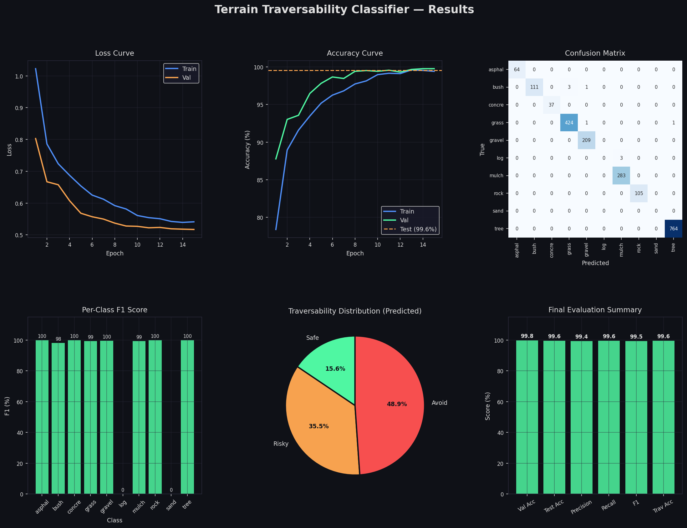

# 🤖 Terrain Traversability Classifier for Autonomous Rovers

A deep learning pipeline that classifies terrain types from camera images and maps them to traversability scores — enabling safe autonomous navigation for rovers in unstructured outdoor environments.

> **Dataset:** [RUGD](http://rugd.vision/) (Real Unstructured Ground Dataset)  
> **Model:** Custom CNN trained from scratch (no pretrained weights)  
> **Output:** Terrain class + traversability costmap (Safe / Risky / Avoid)  
> **Integration target:** ROS 2 Nav2

---

## 📸 Results



---

## 🗂️ Project Structure

```
├── terrain_classifier.py     # Main script: train CNN, evaluate, save model
├── data_preprocessor.py      # Preprocess raw RUGD annotations → patch dataset
├── inference_costmap.py      # Run trained model on a single image → costmap
├── video_inference.py        # Run trained model on video footage
├── results/
│   ├── terrain_cnn.pth               # Saved model weights
│   ├── terrain_classifier_results.png # Training plots & evaluation charts
│   ├── metrics.txt                    # Accuracy, F1, traversability scores
│   └── costmaps/                      # Generated costmap outputs
├── RUGD_sample-data/         # Sample images for quick demo inference
├── video_1.mp4               # Test video 1 (outdoor terrain)
├── video_2.mp4               # Test video 2 (outdoor terrain)
├── Project_Report.md         # Full ML project report
└── pipeline_flowchart.md     # Pipeline architecture diagram
```

---

## 🧠 Model Architecture

A **custom CNN built from scratch** — no pretrained weights, no transfer learning.

```
Input (3 × 128 × 128)
    ↓
4 × ConvBlock: [Conv2d → BN → ReLU → Conv2d → BN → ReLU → MaxPool2d → Dropout2d]
  Channels: 3 → 32 → 64 → 128 → 256
    ↓
Global Average Pooling  (256 × 1 × 1)
    ↓
FC(512) → ReLU → Dropout(0.5) → FC(NUM_CLASSES)
    ↓
Softmax → Terrain Class + Traversability Score
```

**Traversability Mapping:**

| Score | Label | Terrain Types |
|:-----:|-------|---------------|
| 0 | ✅ Safe  | concrete, asphalt, gravel |
| 1 | ⚠️ Risky | grass, mulch, dirt, sand |
| 2 | 🚫 Avoid | rock, mud, water, bush, tree, log |

---

## ⚙️ Setup

### 1. Install dependencies

```bash
pip install torch torchvision matplotlib numpy scikit-learn seaborn tqdm pillow
```

### 2. (Optional) Download RUGD Dataset

Download from [rugd.vision](http://rugd.vision/) and run the preprocessor to build a patch dataset:

```bash
python data_preprocessor.py
```

> **Note:** The raw RUGD dataset is ~5GB and is not included in this repo. If you skip this step, the model uses a synthetic fallback dataset for testing (`USE_SYNTHETIC = True` in `terrain_classifier.py`).

---

## 🚀 Usage

### Step 1 — Train the model

```bash
python terrain_classifier.py
```

This trains the CNN for **15 epochs** on the RUGD patch dataset, evaluates on the test split, saves the model to `results/terrain_cnn.pth`, and generates evaluation plots.

---

### Step 2a — Inference on a single image

```bash
# Use a specific image
python inference_costmap.py --image path/to/your/image.png

# Or auto-pick a random sample from RUGD_sample-data/
python inference_costmap.py
```

Generates a color-coded **traversability costmap** overlay:
- 🟢 Green = Safe
- 🟠 Orange = Risky
- 🔴 Red = Avoid

---

### Step 2b — Inference on video

```bash
python video_inference.py
```

Processes `video_1.mp4` and `video_2.mp4` frame-by-frame, overlaying traversability labels in real time.

---

## 📊 Training Configuration

| Parameter | Value |
|-----------|-------|
| Image size | 128 × 128 |
| Batch size | 32 |
| Epochs | 15 |
| Optimizer | Adam (lr=1e-3, wd=1e-4) |
| Scheduler | CosineAnnealingLR |
| Loss | CrossEntropyLoss (label smoothing=0.1) |
| Train / Val / Test split | 70% / 15% / 15% |

---

## 📁 Loading the Saved Model

```python
import torch
import torch.nn as nn

class TerrainCNN(nn.Module):
    def __init__(self, num_classes):
        super().__init__()
        def conv_block(in_ch, out_ch):
            return nn.Sequential(
                nn.Conv2d(in_ch, out_ch, 3, padding=1, bias=False),
                nn.BatchNorm2d(out_ch), nn.ReLU(inplace=True),
                nn.Conv2d(out_ch, out_ch, 3, padding=1, bias=False),
                nn.BatchNorm2d(out_ch), nn.ReLU(inplace=True),
                nn.MaxPool2d(2, 2), nn.Dropout2d(0.1),
            )
        self.features = nn.Sequential(
            conv_block(3,32), conv_block(32,64),
            conv_block(64,128), conv_block(128,256),
        )
        self.gap = nn.AdaptiveAvgPool2d(1)
        self.classifier = nn.Sequential(
            nn.Flatten(), nn.Linear(256,512),
            nn.ReLU(inplace=True), nn.Dropout(0.5),
            nn.Linear(512, num_classes),
        )
    def forward(self, x):
        return self.classifier(self.gap(self.features(x)))

CLASS_NAMES = ['asphalt', 'bush', 'concrete', 'grass', 'gravel',
               'log', 'mulch', 'rock', 'sand', 'tree']

model = TerrainCNN(num_classes=len(CLASS_NAMES))
model.load_state_dict(torch.load("results/terrain_cnn.pth", map_location="cpu"))
model.eval()
```

---

## 🗺️ ROS 2 Nav2 Integration

The traversability scores (0=Safe, 1=Risky, 2=Avoid) are designed to map directly to **Nav2 costmap values**, enabling the rover to plan paths that prefer safe terrain and avoid hazardous zones.

See [`pipeline_flowchart.md`](pipeline_flowchart.md) for the full system architecture.

---

## 📄 Report

A full ML project report covering the problem statement, dataset description, model architecture, training setup, evaluation metrics, and conclusions is available in [`Project_Report.md`](Project_Report.md).

---

## 📜 License

This project is released under the [MIT License](LICENSE).

---

## 🙏 Acknowledgements

- [RUGD Dataset](http://rugd.vision/) — Wigness et al., IROS 2019
- PyTorch, torchvision, scikit-learn, matplotlib, seaborn
