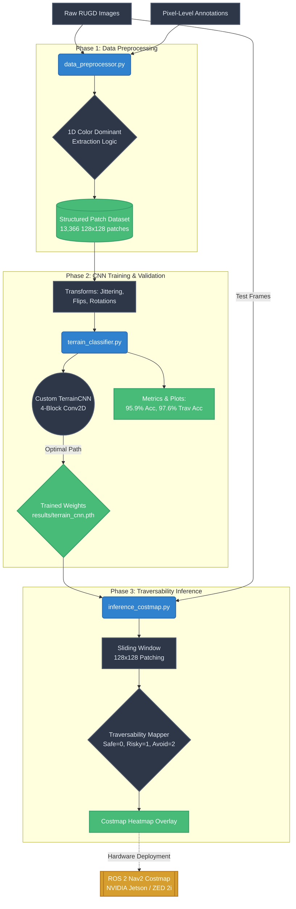

# Terrain Traversability Classifier Pipeline

The following flowchart breaks down the entire lifecycle of our machine learning pipeline, mapping how raw unstructured terrain data becomes a workable navigation costmap for our rover system.

### Breakdown of Pipeline Phases
1. **Phase 1: Data Preprocessing**: We feed the raw, full-scale RUGD imagery paired with masking annotations into `data_preprocessor.py`. The script uses intensive color comparisons to chop the images down into perfectly square 128x128 patches that serve as target datasets strictly categorizing 10 terrain environments.
2. **Phase 2: CNN Training**: These patches are sent into `terrain_classifier.py`. PyTorch injects random perturbations directly mimicking environmental light variances. The resulting Custom `TerrainCNN` architecture outputs weights and visual evaluation plots.
3. **Phase 3: Live Inference**: Utilizing the trained `TerrainCNN` weights, our `inference_costmap.py` runs an automated sliding window across brand-new, unseen full-sized environment frames. It maps the classes directly out to our numeric `0/1/2` safety values, culminating as a visual heatmap directly compatible with Nav2.
